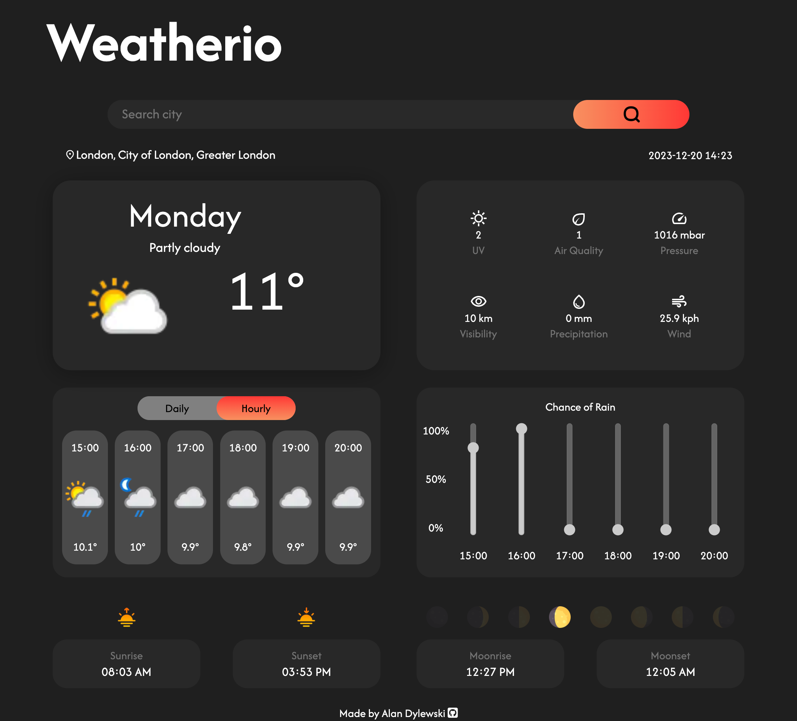
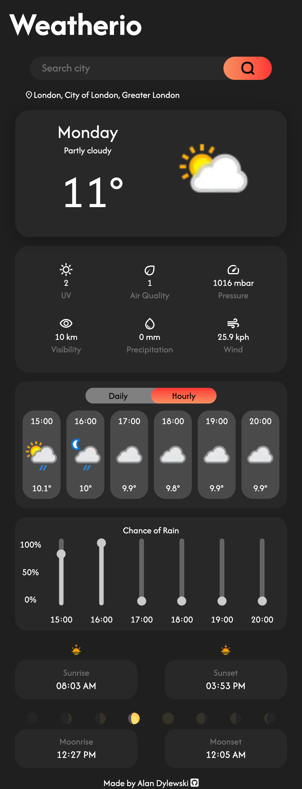

# weather-app

Weatherio: A Weather dashboard powered by WeatherAPI.com

Live 👉 https://dylewskii.github.io/weather-app/

## Project Objectives:
- Use weatherapi to fetch and then display weather data.
- Utilise async functions.

## Final Outcome:

## Future Improvements:
- Display more data points (chance of snow, expand details panel etc).
- Improve error handling.

## Languages used:
-    
-    
- 

## Credits:
- Powered by <a href="https://www.weatherapi.com/" title="Free Weather API">WeatherAPI.com</a>

Icons:
- Moons <a href="https://www.flaticon.com/free-icons/moon" title="moon icons">Moon icons created by Freepik - Flaticon</a>
- Sunset <a href="https://www.flaticon.com/free-icons/sunset" title="sunset icons">Sunset icons created by Icon Hubs - Flaticon</a>
- Sunrise <a href="https://www.flaticon.com/free-icons/sunrise" title="sunrise icons">Sunrise icons created by Icon Hubs - Flaticon</a>